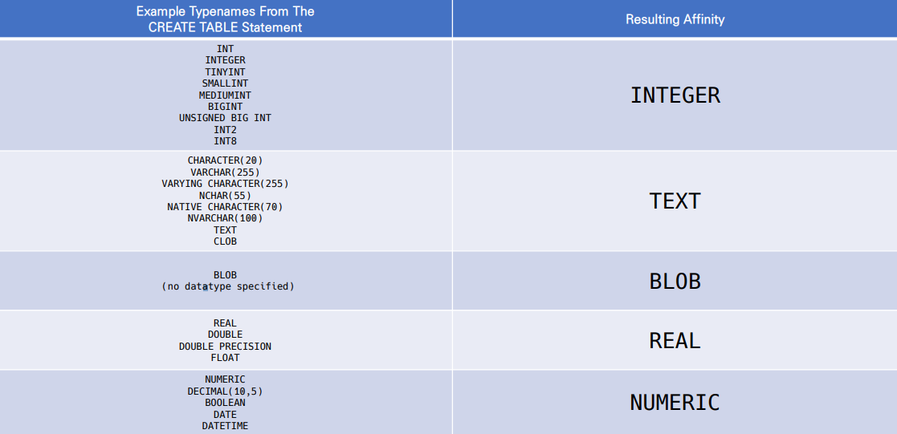
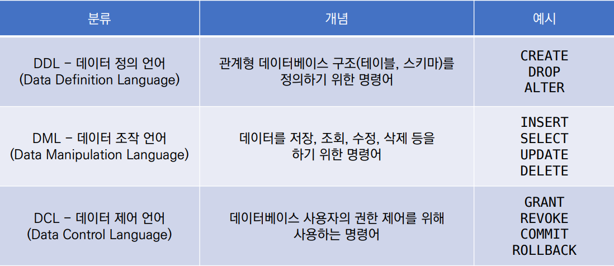

# Database

## Database란?

- 데이터베이스는 체계화된 데이터의 모임
- 여러 사람이 공유하고 사용할 목적으로 통합 관리되는 정보의 집합
- 논리적으로 연관된 (하나 이상의) 자료의 모음으로 그 내용을 고도로 구조화 함으로써 검색과 갱신의 효율화를 꾀한 것
- 즉, 몇 개의 자료 파일을 조직적으로 통합하여 자료 항목의 중복을 없애고 자료를 구조화하여 기억시켜 놓은 자료의 집합체

### Database 

#### 장점 

- 데이터 중복 최소화
- 데이터 무결성 (정확한 정보를 보장)
- 데이터 일관성
- 데이터 독립성 (물리적 / 논리적)
- 데이터 표준화
- 데이터 보안 유지

### RDB

- 관계형 데이터베이스 (RDB, Relational Database)
  - 서로 관련된 데이터를 저장하고 접근할 수 있는 데이터베이스 유형
  - 키(key)와 값(value)들의 간단한 관계(relation)를 표(table) 형태로 정리한 데이터베이스
- 스키마 (schema)
  - 데이터베이스에서 자료의 구조, 표현방법, 관계등 전반적인 명세를 기술한 것
- 테이블 (table)
  - 열(컬럼/필드)과 행(레코드/값)의 모델을 사용해 조직된 데이터 요소들의 집합
- 열 (column) : 각 열에 고유한 데이터 형식 지정
  - 아래의 예시에서는 name이란 필드에 고객의 이름(TEXT) 정보가 저장
- 행 (row) : 실제 데이터가 저장되는 형태
  - 아래의 예시에서는 총 3명의 고객정보가 저장되어 있음(레코드가 3개)
- 기본키 (Primary Key) : 각 행(레코드)의 고유 값
  - 반드시 설정해야 하며, 데이터베이스 관리 및 관계 설정 시 주요하게 활용 됨

### RDBMS

- 관계형 데이터베이스 관리 시스템 (RDBMS)
  - 관계형 모델을 기반으로 하는 데이터베이스 관리시스템을 의미
- SQLite
  - 서버 형태가 아닌 파일 형식으로 응용 프로그램에 넣어서 사용하는 비교적 가벼운 데이터베이스
  - 구글 안드로이드 운영체제에 기본적으로 탑재된 데이터베이스이며, 임베디드 소프트웨어에도 많이 활용됨
  - 로컬에서 간단한 DB 구성을 할 수 있으며, 오픈소스 프로젝트이기 때문에 자유롭게 사용가능
- SQLite Data Type
  1. NULL
  2. INTEGER
     - 크기에 따라 0, 1, 2, 3, 4, 6 또는 8바이트에 저장된 부호 있는 정수
  3. REAL
     - 8바이트 부동 소수점 숫자로 저장된 부동 소수점 값
  4. TEXT
  5. BLOB
     - 입력된 그대로 정확히 저장된 데이터 (별다른 타입 없이 그대로 저장)

## SQL

### SQL (Structured Query Language)이란?

- 관계형 데이터베이스 관리시스템의 데이터 관리를 위해 설계된 특수 목적으로 프로그래밍 언어
- 데이터베이스 스키마 생성 및 수정
-  자료의 검색 및 관리
- 데이터베이스 객체 접근 조정 관리

#### SQL Keywords - Data Manipulation Language

- INSERT : 새로운 데이터 삽입(추가)
- SELECT : 저장되어있는 데이터 조회
- UPDATE : 저장되어있는 데이터 갱신
- DELETE : 저장되어있는 데이터 삭제

