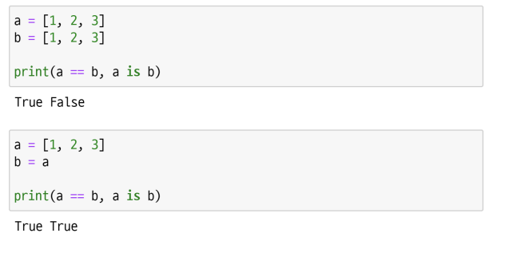

# oop


## oop 기초


### 기본 문법

```python
# 클래스 정의
class MyClass:
    pass
# 인스턴스 생성
my_instance = MyClass()
# 매서드 호출
my_instance.my_method()
# 속성
my_instance.my_attribute

```

- 객체의 틀(클래스)을 가지고, 객체(인스턴스)를 생성한다
- 클래스와 인스턴스
  - 클래스 : 객체들의 분류(class)
  - 인스턴스 : 하나하나의 실체/예(instance)
- 속성
  - 특정 데이터 타입/클래스의 객체들이 가지게 될 상태/데이터를 의미
- 메소드
  -  특정 데이터 타입/클래스의 객체에 공통적으로 적용 가능한 행위(함수)
- 객체 비교하기
  - == 
    - 동등한(equal)
    - 변수가 참조하는 객체가 동등한(내용이 같은) 경우 True
    - 두 객체가 같아 보이지만 실제로 동일한 대상을 가리키고 있다고 확인해 준 것은 아님
  - is
    - 동일한(identical) 
    - 두 변수가 동일한 객체를 가리키는 경우 True
- 객체 비교하기



### 클래스

- 클래스 속성
  - 한 클래스의 모든 인스턴스라도 똑같은 값을 가지고 있는 속성
  - 클래스 선언 내부에서 정의
  - <classname>.<name>으로 접근 및 할당


- 인스턴스와 클래스 간의 이름 공간(namespace)
  - 클래스를 정의하면, 클래스와 해당하는 이름 공간 생성
  - 인스턴스를 만들면, 인스턴스 객체가 생성되고 이름 공간 생성
  - 인스턴스에서 특정 속성에 접근하면, 인스턴스-클래스 순으로 탐색


- 클래스 메소드
  - 클래스가 사용할 메소드
  - @classmethod 데코레이터를 사용하여 정의
    - 데코레이터 : 함수를 어떤 함수로 꾸며서 새로운 기능을 부여
  - 호출 시, 첫번째 인자로 클래스(cls)가 전달됨


- 스태틱 메소드
  - 인스턴스 변수, 클래스 변수를 전혀 다루지 않는 메소드
- 사용
  - 속성을 다루지 않고 단지 기능(행동)만을 하는 메소드를 정의할 때, 사용
  - @staticmethod 데코레이터를 사용하여 정의
  - 호출 시, 어떠한 인자도 전달되지 않음 (클래스 정보에 접근/수정 불가)


- 정리
  - 클래스 구현
    - 클래스 정의
    - 데이터 속성 정의 (객체의 정보는 무엇인지)
    - 메소드 정의 (객체를 어떻게 사용할 것인지)
  - 클래스 활용
    - 해당 객체 타입의 인스턴스 생성 및 조작


- 메소드 정리 
  - 인스턴스 메소드 
  - 호출한 인스턴스를 의미하는 self 매개 변수를 통해 인스턴스를 조작 
- 클래스 메소드 
  - 클래스를 의미하는 cls 매개  변수를 통해 클래스를 조작
- 스태틱 메소드 
  - 인스턴스나 클래스를 의미하는 매개변수는 사용하지 않음 
    - 즉, 객체 상태나 클래스 상태를 수정할 수 없음
    - 일반 함수처럼 동작하지만 클래스의 이름공간에 귀속 됨
    - 주로 해당 클래스로 한정하는 용도로 사용


### 인스턴스

- 인스턴스 변수
  - 인스턴스가 개인적으로 가지고 있는 속성(attribute)
  - 각 인스턴스들의 고유한 변수
- 생성자 메소드에서 self.으로 정의
- 인스턴스가 생성된 이후 .으로 접근 및 할당


- 인스턴스 메소드
  - 인스턴스 변수를 사용하거나, 인스턴스 변수에 값을 설정하는 메소드
  - 클래스 내부에 정의되는 메소드의 기본
  - 호출 시, 첫번째 인자로 인스턴스 자기자신(self)이 전달됨
- self
  - 인스턴스 자기자신.
  - 파이썬에서 인스턴스 메소드는 호출 시 첫번째 인자로 인스턴스 자신이 전달되게 설계
    - 매개변수 이름으로 self를 첫번째 인자로 정의
    - 다른 단어로 써도 작동하지만, 파이썬의 암묵적인 규칙
- 생성자(constructor) 메소드
  - 인스턴스 객체가 생성될 때 자동으로 호출되는 메소드
  - 인스턴스 변수들의 초기값을 설정
    - 인스턴스 생성
    - __init__메소드 자동 호출
- 소멸자(destructor) 메소드
  - 인스턴스 객체가 소멸(파괴)되기 직전에 호출되는 메소드

