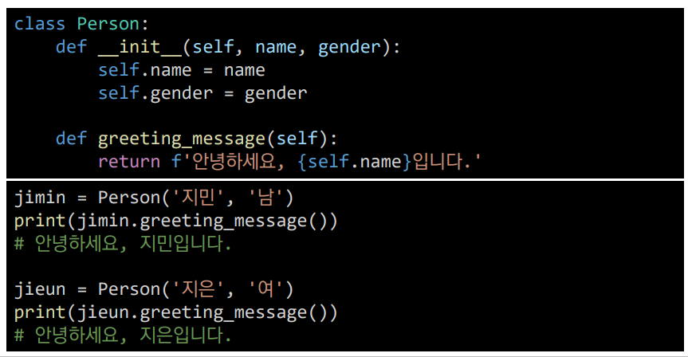

# 객체지향 프로그래밍

## 객체

- 객체(object)의 특징
  - 타입(type) : 어떤 연산자(operator)와 조작(method)이 가능한가?
  - 속성(attribute) : 어떤 상태(데이터)를 가지는가?
  - 조작법(method) : 어떤 행위(함수)를 할 수 있는가?
- 객체지향 프로그래밍이란?
  - 프로그램을 여러 개의 독립된 객체들과 그 객체들 간의 상호작용으로 파악하는 프로그래밍 방법

- 현실 세계를 프로그램 설계에 반영(추상화)

- 사각형 넓이 구하는 코드

- 사각형 - 클래스(class)
- 각 사각형 (R1,R2) – 인스턴스(instance)
- 사각형의 정보 - 속성(attribute)
- 사각형의 행동/기능 – 메소드(method)

### 객체 지향의 장점(위키피디아)

- 객체 지향 프로그래밍은 프로그램을 유연하고 변경이 용이하게 만들기 때문에 대규모 소프트웨어 개발에 많이 사용됩니다.
- 또한, 프로그래밍을 더 배우기 쉽게 하고 소프트웨어 개발과 보수를 간편하게 하며, 보다 직관적인 코드 분석을 가능하게 하는 장점을 가지고 있습니다.
- 

### 객체지향의 핵심 4가지

- 추상화

- 상속

  - 두 클래스 사이 부모 – 자식 관계를 정립하는 것

  - 클래스는 상속이 가능함

    - 모든 파이썬 클래스는 object를 상속 받음

  - 상속을 통한 메소드 재사용

    

- 상속 정리

  - 파이썬의 모든 클래스는 object로부터 상속됨
  - 부모 클래스의 모든 요소(속성, 메소드)가 상속됨
  - super()를 통해 부모 클래스의 요소를 호출할 수 있음
  - 메소드 오버라이딩을 통해 자식 클래스에서 재정의 가능함
  - 상속관계에서의 이름 공간은 인스턴스, 자식 클래스, 부모 클래스 순으로 탐색

- 다형성
  - 여러 모양을 뜻하는 그리스어
  - 동일한 메소드가 클래스에 따라 다르게 행동할 수 있음을 의미
  - 즉, 서로 다른 클래스에 속해있는 객체들이 동일한 메시지에 대해 다른 방식으로 응답될 수 있음

- 캡술화
  - 객체의 일부 구현 내용에 대해 외부로부터의 직접적인 액세스를 차단
  - 파이썬에서 기능상으로 존재하지 않지만, 관용적으로 사용되는 표현이 있음

